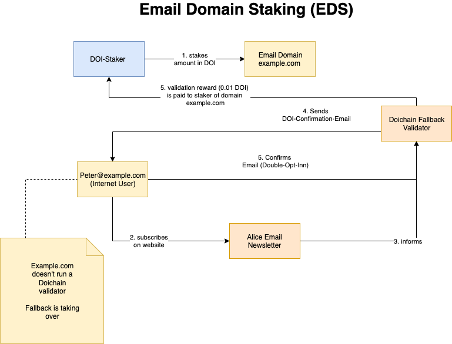

About DoiWorks
==============

.. _problem_and_challenge:

Problem & Challenge
-------------------
https://www.doichain.org/en/problemstellungen-und-loesungen/

.. _alice_bob_and_peter:

Alice, Bob & Peter
------------------
On blockchains we send transactions from A to B. In the past we started calling A – Alice and B – Bob.
We want to reuse this tradition and add another party Peter. 

Peter is an usual email user subscribing to a newsletter at Alice’s ordinary website.
Alice is a brand, an e-commerce platform or another email marketing party, which intends to send an email to Peter. 
Doing so Alice submits a Doi-request-transaction to the Doichain blockchain and pays a set of fees for that process. 
(Please see: How much does it cost to store a Double Opt-In inside Doichain?)

Bob is in best case the email provider of Peter, which receives the Doi-request-transaction from Alice 
and hands out the Doi-request-email to Peter. Peters email confirmation (DOI) gets submitted in a second transaction into 
Doichain. Bob receives a reward from Alice for validating Peters email for Alice.

In case Peters ESP (Email Service Provider) or ISP doesn't run a Doichain validator yet. DoiWorks provides a fallback validator until 
Peters ESP decides to setup a Doichain validator for its users.
Please read on: How Self-Decentralizing System

.. _self_decentralizing_system:

Self Decentralizing System
--------------------------
A blockchain analyst of the Double Opt-In Protocol might instantly remark, that a centralized fallback 
validator isn't a good solution according to decentralized blockchain principles.

Here it needs to be pointed out that a fallback Doichain validator is only necessary until email providers  
run their own validator. Ever email user who doesn't like the centralized approach of the Doichain validator 
can run its own node in a decentralized way for all it's own responsible email domains. 

.. _email_domain_staking:

Email Domain Staking (EDS)
--------------------------
The DOI-Protocol isn't per se decentralized from the beginning. 

In order to incentivize mass adoption we invented an innovative Email Domain Staking (EDS) model:

1. Holders of DOI should be able to stake there DOI, receive rewards while beeing insentivized to enhance the network effect and mass adoption of Doichain.
2. Holders of DOI are encouraged to stake DOI associated with an email domain (e.g. ***@example.com).
3. The validation reward (0.01 DOI) of any Double-Opt-In request which is still served by the fallback Doichain validator fall to the staker of the targetted email domain of the DOI request.
4. The stake associated with an email domain can be outbid by another staker who wishs to collect validations rewards for that domain.
5. If an email domain stake is overbid the previous stake is automatically released back to the previuous staker.

.. _history:

History
-------
- 2017 - fork of Namecoin blockchain Doichain
- 2018 - development of prototype DOI-protocol (v0.1)
- 2019 
- 2020
- 2021
- 2022

.. _roadmap:

Roadmap
-------

.. _roadmap:

Roadmap
-------